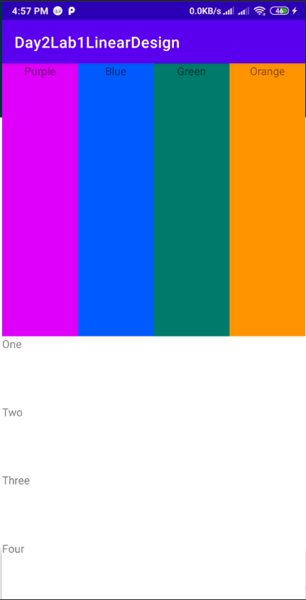
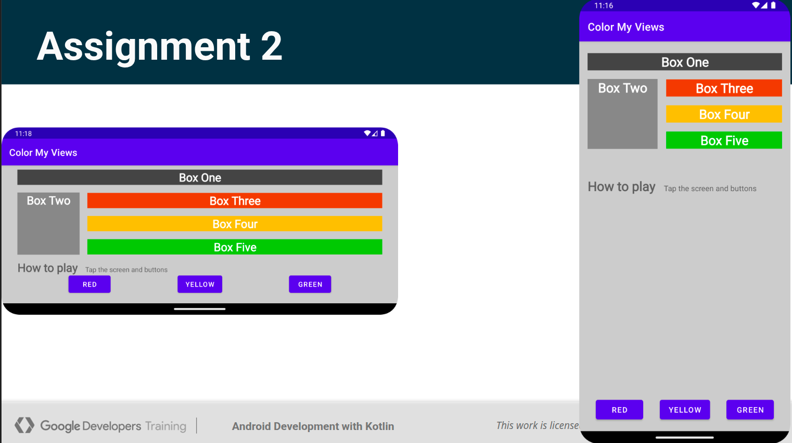
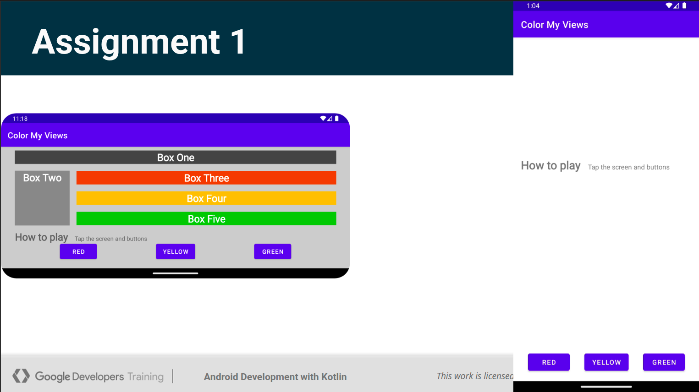
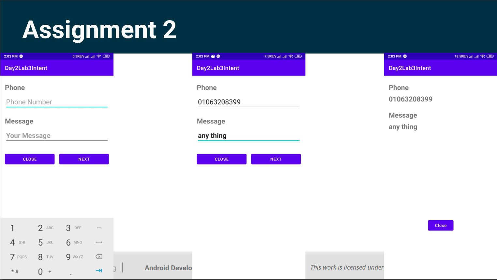
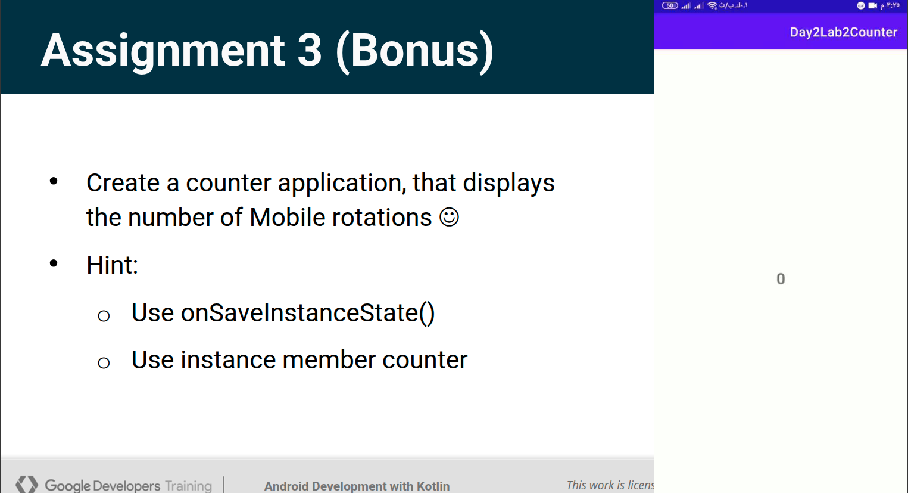

# Tasks Description

**Android development with Kotlin-XML Course Tasks**

---

**Session 1**

1. Create Hello World Android Project and check the activity life-cycle.
---
**Session 2**

1. 
2. 
	when app running all elements display as a colorful elements
3. Get Android Accessibility codelab from [Here](https://developer.android.com/codelabs/starting-android-accessibility)
---
**Session 3**

1. 
	when app running no element is colored and it colored only if you clicking on it
2.  
3. 
	Hint:
		app contain in count also if app is restart 
		
		don't count restart as a move
		
---
