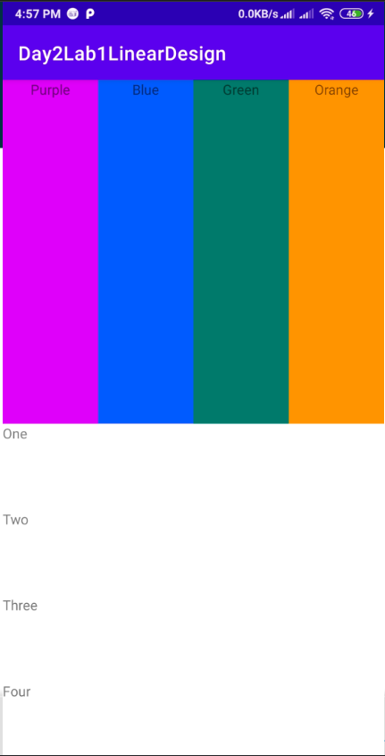
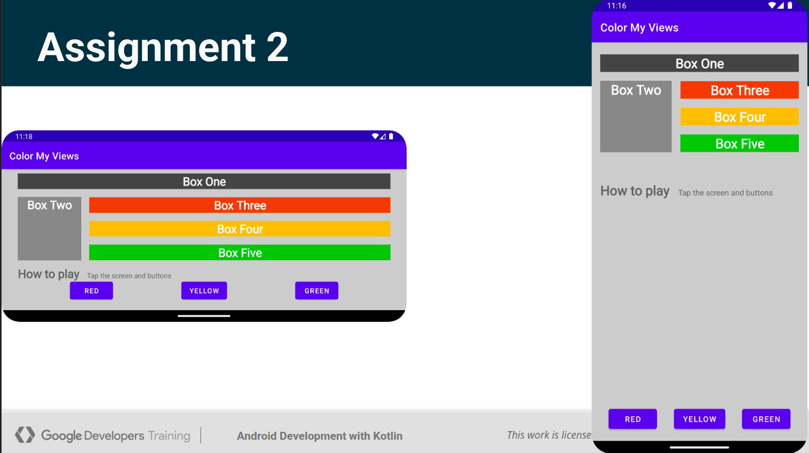
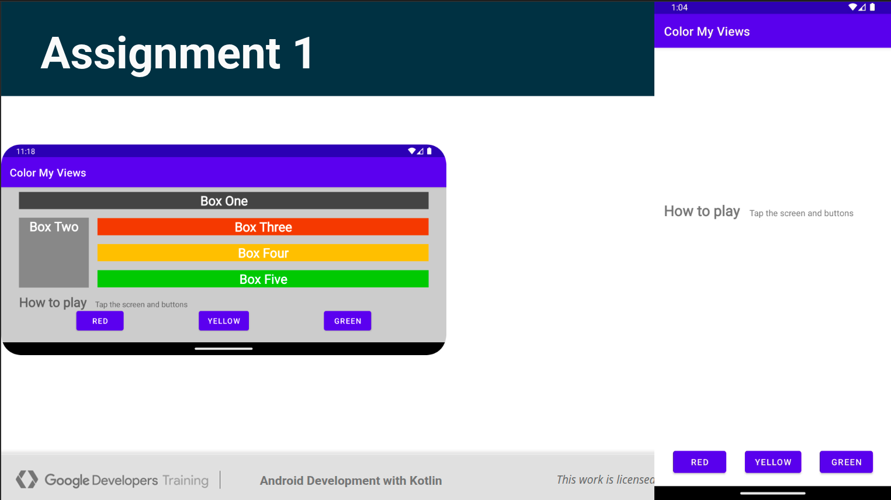
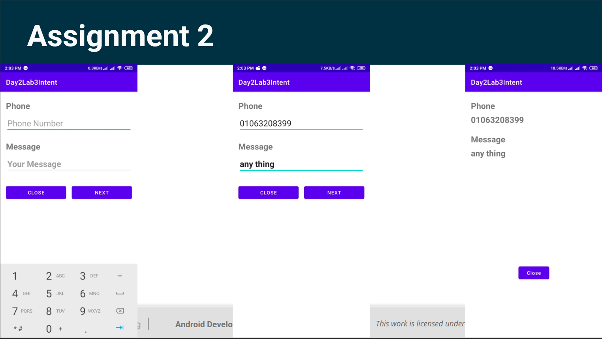
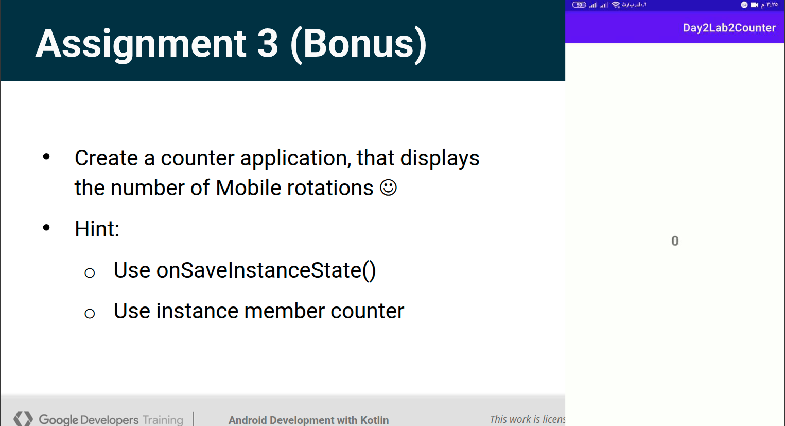
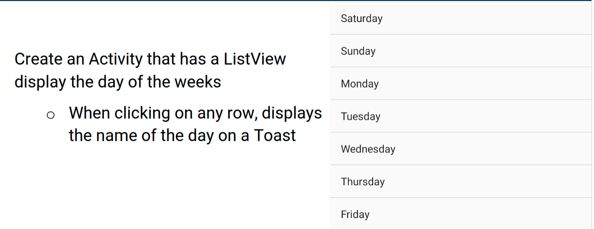
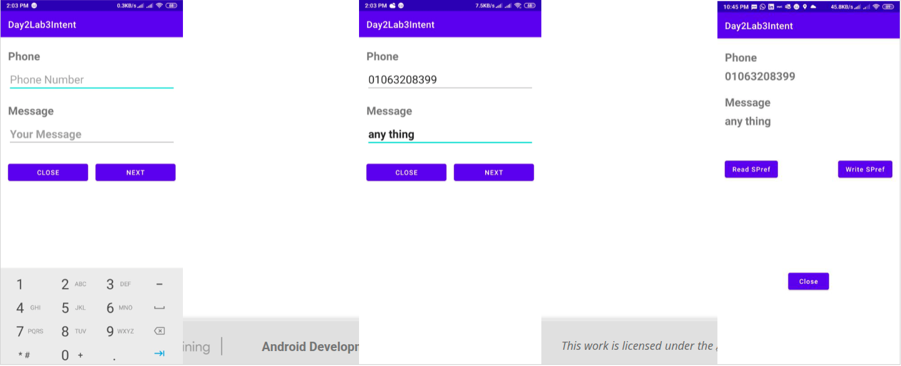
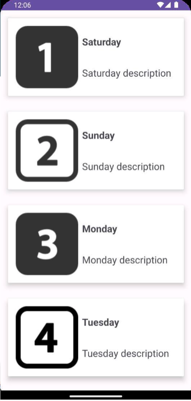
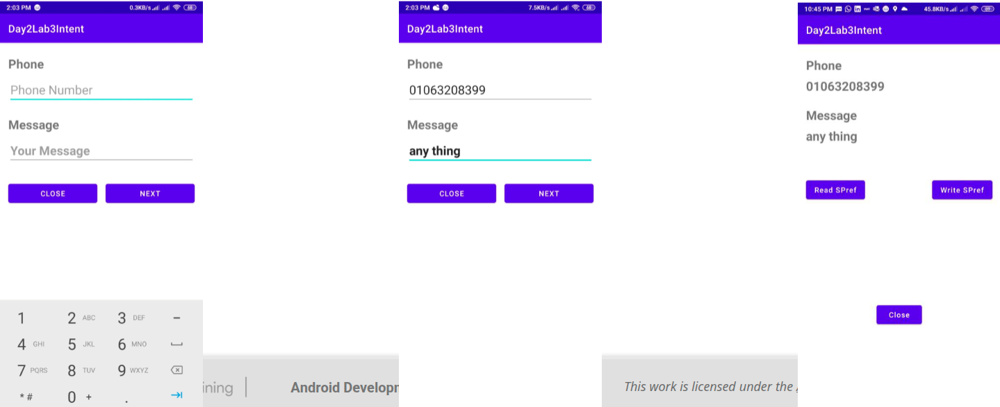
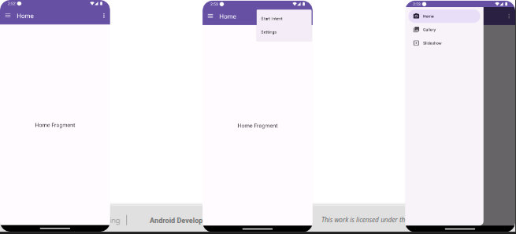

# Android Development with Kotlin - XML Course Tasks

---

## Session 1

1. Create Hello World Android Project and check the activity lifecycle.

---

## Session 2

1. 
2. 
   - When app is running, all elements should display as colorful elements.
3. Complete [Android Accessibility Codelab](https://developer.android.com/codelabs/starting-android-accessibility).

---

## Session 3

1. When app is running, no element is colored and it colored only if you click on it.
   - 
2. 
3. 
   - App should contain counting (even if app is restarted).
   - Don't count restart as a move.

---

## Session 4

1. 
2. Create an application that displays a RecyclerView with each row consisting of:
   - ImageView
   - 2 TextViews

---

## Session 5

1. Create an Activity with a static fragment and override all of the Fragment's lifecycle methods.
2. Create an Activity with a dynamic fragment and override all of the Fragment's lifecycle methods.
3. Create an Activity with two fragments, static & dynamic.

---

## Session 6

1. Apply Shared Preference
   - 
2. Add card to the RecyclerView
   - 
3. Apply DataStore
   - 

---

## Session 7

1. Create the following UI
   - 
2. Create NavGraph

---

## Session 8

Create two screens with Navigation Component:

1. Create a screen with email and password TextFields and a login button.
2. Create a screen with a list of data using RecyclerView (the data is a list of students, each student has: name, age, gpa, image).

---

## Session 9

Apply Repository pattern and full cycle with MVVM for the previous task (Session 8).

---

## Session 10

Apply Room database for the 1st project in Session 6 assignment.
