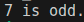

# Task Descripton

## Implementation

Here is implementation of tasks descriped above

### Hello World

[Code](./HelloWorld/HelloWorld.java)

Result :

### Even Or Odd

[Code](./EvenOrOdd/EvenOrOdd.java)

Result :

### IP Seperation

[Code](./IP_Seperation/IP_Seperation.java)

Result :

[Author](https://github.com/jAmikA78/) - [MIT License](./../LICENSE)
