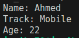

# Task Descripton

## Implementation

Here is implementation of tasks descriped above

### Student class

[Code](./Student/)

Result :

### Complex Number class

[Code](./Complex/)

Result :

[Author](https://github.com/jAmikA78/) - [MIT License](./../LICENSE)
