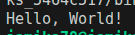
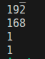

# Task Descripton

## Implementation

Here is implementation of tasks descriped above

### Hello World

[Code](./HelloWorld.java)
Result :

### Even Or Odd

[Code](./EvenOrOdd.java)
Result :

### IP Seperation

[Code](./IP_Seperation.java)
Result :

[Author](https://github.com/jAmikA78/) - [MIT License](./../LICENSE)
