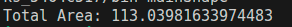
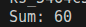

# Task Descripton

## Implementation

Here is implementation of tasks descriped above

### Shapes

[Code](./shapes/)
Result :

### Override Example

[Code](./overrideExample/)
Result :

[Author](https://github.com/jAmikA78/) - [MIT License](./../LICENSE)
